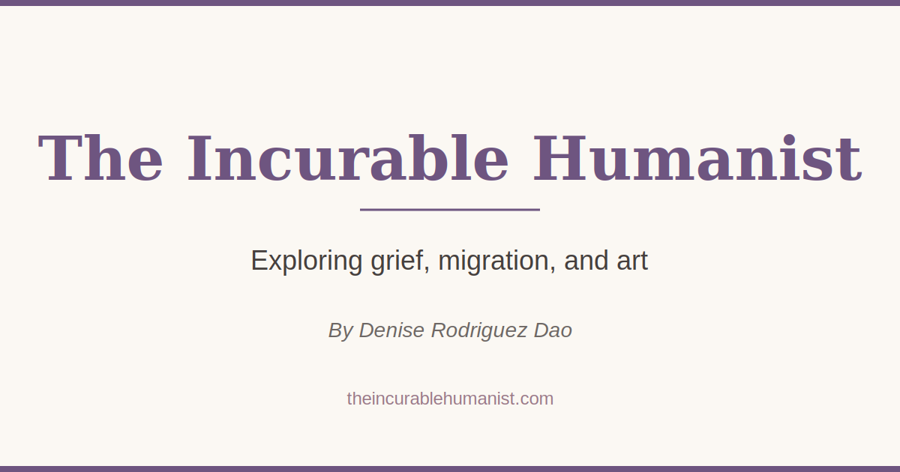

# The Incurable Humanist

A personal publication website exploring grief, migration, and art through weekly newsletters and essays by Denise Rodriguez Dao.



## 🌟 Features

- **Responsive Design**: Beautiful on all devices (mobile, tablet, desktop)
- **SEO Optimized**: Comprehensive meta tags, sitemap, Open Graph support
- **Accessible**: WCAG compliant with skip links, ARIA labels, keyboard navigation
- **Contact Form**: Integrated with Formspree for email submissions
- **Social Sharing**: Optimized cards for Twitter, Facebook, LinkedIn
- **Performance**: Fast loading with Vite build optimization
- **Modern Stack**: React 19, TypeScript, Tailwind CSS

## 📋 Pages

- **Home**: Hero section with subscribe CTA and social links
- **About**: Project description and founder biography
- **Press**: Media coverage and press mentions
- **Contact**: Contact form and direct communication options
- **Newsletter**: Subscribe page with Substack integration
- **404**: Custom error page

## 🚀 Quick Start

See [SETUP.md](./SETUP.md) for detailed setup instructions.

```bash
# Install dependencies
npm install

# Start development server
npm run dev

# Build for production
npm run build
```

## 📦 Tech Stack

- **Framework**: React 19 with TypeScript
- **Build Tool**: Vite
- **Styling**: Tailwind CSS
- **Routing**: React Router v6
- **Forms**: Formspree
- **Fonts**: Cormorant Garamond (headings), Inter (body)

## 🎨 Design System

**Colors:**
- Background: `#fbf8f3` (warm cream)
- Surface: `#faf6ef` (lighter cream)
- Accent: `#6e5580` (purple)
- Accent 2: `#9a7a89` (muted rose)
- Text: `#453f3d` (dark brown)

**Typography:**
- Headings: Cormorant Garamond (serif)
- Body: Inter (sans-serif)
- Scale: Fluid responsive sizing

**Spacing:**
- Container: max-width 1400px with responsive padding
- Sections: 20-36px vertical spacing
- Cards: 10-14px padding

## 📁 Project Structure

```
frontend/
├── public/                 # Static assets
│   ├── favicon.svg        # Site favicon
│   ├── og-image.svg       # Social sharing image
│   ├── robots.txt         # Search engine directives
│   └── sitemap.xml        # SEO sitemap
├── src/
│   ├── components/        # Reusable components
│   │   ├── Card.tsx
│   │   ├── ContactForm.tsx
│   │   ├── Footer.tsx
│   │   ├── PillButton.tsx
│   │   ├── PressItemCard.tsx
│   │   ├── SectionTitle.tsx
│   │   └── SocialIconButton.tsx
│   ├── config/            # Configuration
│   │   └── site.ts        # Site-wide settings
│   ├── pages/             # Page components
│   │   ├── About.tsx
│   │   ├── Contact.tsx
│   │   ├── Home.tsx
│   │   ├── Newsletter.tsx
│   │   ├── NotFound.tsx
│   │   └── Press.tsx
│   ├── shell/             # Layout components
│   │   └── App.tsx        # Main app shell
│   ├── styles/            # Global styles
│   │   └── globals.css
│   └── main.tsx           # App entry point
├── .env.example           # Environment variables template
├── index.html             # HTML template with meta tags
├── package.json
├── tailwind.config.ts     # Tailwind configuration
├── tsconfig.json          # TypeScript configuration
├── vite.config.ts         # Vite configuration
├── SETUP.md               # Setup instructions
└── DEPLOYMENT.md          # Deployment guide
```

## 🔧 Configuration

### Site Configuration

Edit `src/config/site.ts` to update:
- Site name and branding
- Navigation links
- Social media URLs
- Contact email
- Press articles

### Environment Variables

Create `.env` file (optional):
```env
VITE_FORMSPREE_ID=your_formspree_id
```

## 🚢 Deployment

See [DEPLOYMENT.md](./DEPLOYMENT.md) for comprehensive deployment instructions.

**Quick Deploy to Vercel:**
```bash
npm install -g vercel
vercel --prod
```

**Supported Platforms:**
- Vercel (recommended)
- Netlify
- Cloudflare Pages
- GitHub Pages
- Any static hosting service

## ✅ Pre-Deployment Checklist

Before deploying:

1. Replace `YOUR_FORMSPREE_ID` in `src/components/ContactForm.tsx`
2. Update domain in `index.html`, `sitemap.xml`, `robots.txt`
3. Run `npm run build` to verify no errors
4. Test contact form functionality
5. Review all content in `src/config/site.ts`

## 🧪 Testing

```bash
# Run development server
npm run dev

# Build for production
npm run build

# Preview production build
npm run preview
```

**Manual Testing:**
- All pages load correctly
- Contact form submits successfully
- Links navigate properly
- Responsive on mobile/tablet/desktop
- Social media preview cards display

## 📈 Performance

- **Build Size**: ~250KB JavaScript, ~18KB CSS (gzipped: ~80KB + ~4KB)
- **Lighthouse Score**: Target 90+ on all metrics
- **Core Web Vitals**: Optimized for LCP, FID, CLS

## ♿ Accessibility

- WCAG 2.1 Level AA compliant
- Keyboard navigation support
- Screen reader optimized
- Skip to main content link
- Proper ARIA labels
- Semantic HTML structure
- Focus visible states
- Respects reduced motion preferences

## 🔒 Security

- Form validation and sanitization
- HTTPS enforced (on deployment)
- No sensitive data in client
- Security headers configured
- External links use `rel="noopener noreferrer"`

## 📝 License

© 2025 Denise Rodriguez Dao. All rights reserved.

## 🤝 Contributing

This is a personal project. For issues or suggestions:
1. Create an issue with detailed description
2. Include screenshots if applicable
3. Provide steps to reproduce

## 📧 Contact

For questions about this project:
- Email: info@theincurablehumanist.com
- Website: [theincurablehumanist.com](https://theincurablehumanist.com)

---

Built with ❤️ using React, TypeScript, and Tailwind CSS
